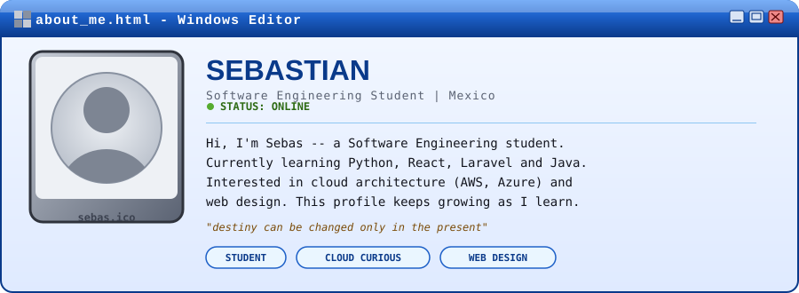

 

 

### ABOUT ME

### TECH STACK // learning

### SKILL LEVEL

### CONNECT

  

  

&lt; &nbsp; <a href="#readme">TOP</a> &nbsp;|&nbsp; <a href="https://github.com/Elsebascrazy">PROFILE</a> &nbsp;|&nbsp; <a href="#tech-stack--learning">STACK</a> &nbsp; &gt;

  

