README

 
👋 About me
I'm Sebas, a Software Engineering student. I'm learning Python, React, Laravel and Java, and I'm especially interested in cloud architecture (AWS, Azure) and web design. This profile will keep growing as I learn.
 
🧰 Tech stack (learning)

 
📊 Skill level

 
🌐 Connect with me

